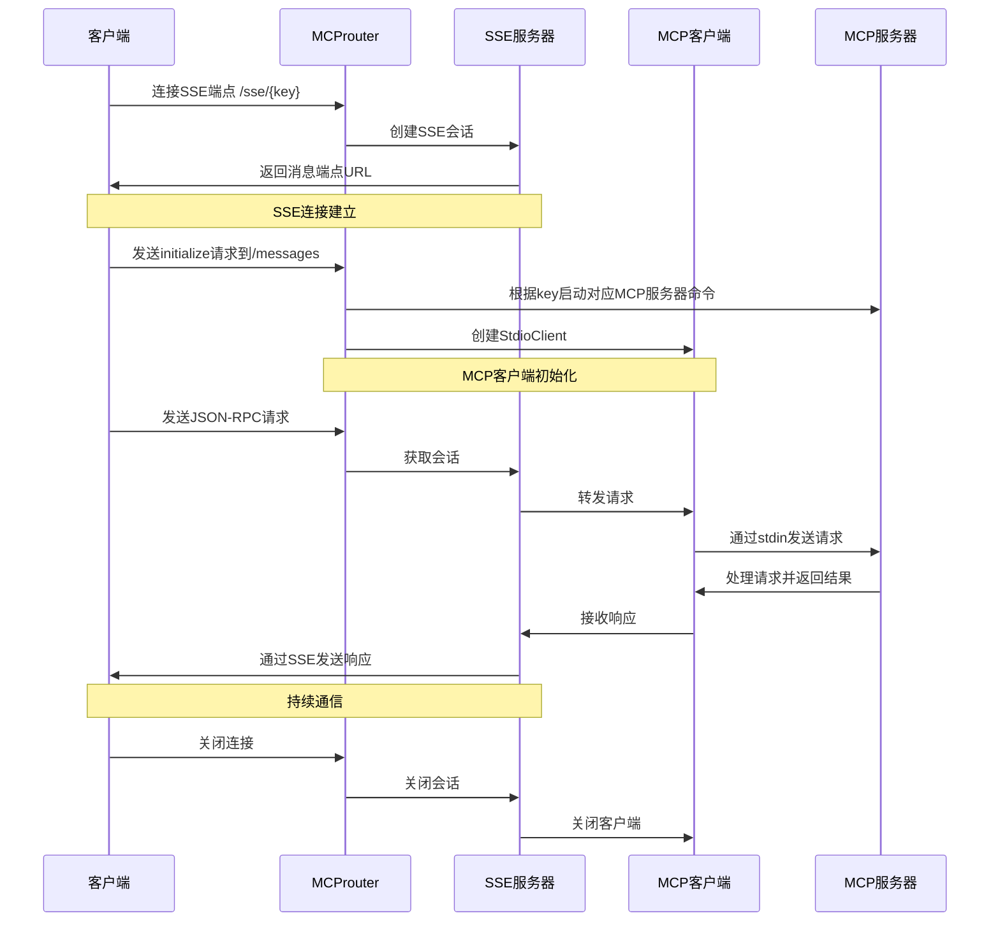

# MCProuter

MCProuter是一个用于Model Context Protocol (MCP) 服务器的SSE (Server-Sent Events) 代理服务。它允许客户端通过HTTP连接到各种MCP服务，简化了MCP服务的集成和管理。

## 功能特点

- 支持多种MCP服务器的代理转发
- 基于SSE的实时数据流传输
- 支持JSON-RPC协议通信
- 可配置的服务器命令管理
- 支持本地配置和远程API配置
- 轻量级HTTP服务器，基于Echo框架

## 快速开始

### 1. 配置文件设置

复制示例配置文件并根据需要进行编辑：

```shell
cp .env.example.toml .env.toml
```

编辑 `.env.toml` 文件，配置你需要的MCP服务器命令：

```toml
[server]
port = 8025

[mcp_server_commands]
puppeteer = "npx -y @modelcontextprotocol/server-puppeteer"
fetch = "uvx mcp-server-fetch"
time = "docker run -i --rm mcp/time"
github = "your-github-mcp-server-command"

[remote_apis]
get_server_command = "https://mcp.so/api/get-server-command"
```

### 2. 启动HTTP服务器

```shell
go run main.go server
```

或者使用编译后的二进制文件：

```shell
./mcprouter server
```

你也可以指定自定义配置文件：

```shell
go run main.go server -c /path/to/your/config.toml
```

### 3. 在MCP客户端中使用代理URL

将以下URL添加到支持MCP的客户端（如Cursor）中：

```
http://localhost:8025/sse/{key}
```

其中 `{key}` 是你在配置文件中设置的MCP服务器命令的键名。例如：

```
http://localhost:8025/sse/github
```

确保你在 `.env.toml` 文件中设置了对应的 `mcp_server_commands.github` 命令。

## 项目架构

### 核心组件

- **SSE服务器**：处理客户端的SSE连接请求
- **MCP客户端**：与后端MCP服务器通信
- **JSON-RPC处理**：处理客户端和服务器之间的JSON-RPC消息
- **会话管理**：管理客户端连接会话

### 工作流程

1. 客户端通过SSE连接到代理服务器
2. 代理服务器根据请求的key启动对应的MCP服务器命令
3. 客户端发送JSON-RPC请求到代理服务器
4. 代理服务器将请求转发到MCP服务器
5. MCP服务器处理请求并返回结果
6. 代理服务器将结果通过SSE发送回客户端



## 高级配置

### 远程API配置

如果本地配置中没有找到对应的MCP服务器命令，MCProuter会尝试从远程API获取命令。这可以通过在配置文件中设置 `remote_apis.get_server_command` 来实现。

### 自定义端口

你可以在配置文件中修改 `server.port` 来更改服务器监听的端口。

## 开发

### 构建项目

```shell
make build
```

### Docker支持

构建Docker镜像：

```shell
make docker-build
```

运行Docker容器：

```shell
docker run -p 8025:8025 -v /path/to/your/config:/app/.env.toml mcprouter
```

## 许可证

请查看项目中的 [LICENSE](LICENSE) 文件。
